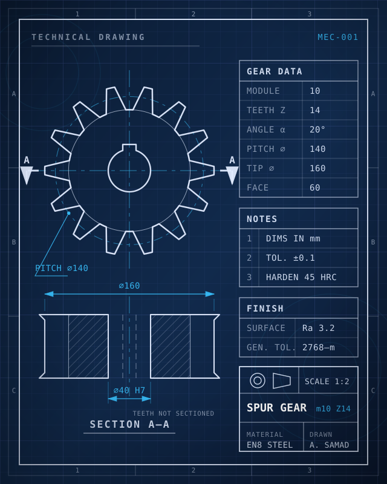

# My Landing Page

A single-page personal portfolio built with plain HTML, CSS, and a small
amount of JavaScript. No build step, no framework, no dependencies — just
open `index.html` in a browser, or serve the folder as a static site.

## Files

- `index.html` — all page content, in one scrolling document.
- `styles.css` — all styling.
- `script.js` — the side scroll-nav logic (scroll-spy + progress rail).
- `blueprint.svg` — the hero image (see below).
- `tools/gen_blueprint.py` — optional generator that produced it.

## Hero image: the blueprint

The hero visual is a static image — `blueprint.svg` — drawn as a real
engineering sheet: a spur-gear front view, a sectioned side view
(SECTION A-A), dimension lines, gear-data / notes / finish blocks and a
title block, all in the site's navy + sky/indigo palette so it blends
with the dark theme instead of stock-photo azure. The gear numbers are
internally consistent (m=10, Z=14: pitch 140, tip 160, face 60), so it
holds up to an engineer's glance.

**To change it, swap the file.** In `index.html` the hero is just:

```html
<div class="blueprint">
  
</div>
```

Point that `src` at any `.svg`, `.png` or `.jpg` you like — a photo of a
real drawing of yours, a CAD export, anything. A 4:5 portrait image fits
the slot best; other ratios are cropped to fit.

To tweak the supplied drawing instead, either edit `blueprint.svg`
directly (it's plain SVG — Inkscape, Illustrator or a text editor all
work), or edit and re-run the optional generator that produced it:

```
python3 tools/gen_blueprint.py
```

That's where the part name, material, "DRAWN BY" name, module/teeth and
colours live, if you'd rather regenerate than hand-edit.

## Sections

Scrolling down `index.html`, top to bottom:

- **Home** (`id="home"`) — name, tagline, short bio, resume/CTA buttons,
  social links, the blueprint image and the "Focused on" card.
- **About** (`id="about"`) — bio blurb and the four stat cards.
- **Credentials** (`id="credentials"`) — certifications and credentials,
  see below.
- **Projects** (`id="projects"`) — project cards.
- **Contact** (`id="contact"`) — email/phone/location cards and social
  links.

The top navbar links (`#home`, `#about`, …) jump to each section, and
`html { scroll-behavior: smooth }` makes that a smooth scroll rather than
a jump cut.

## The side scroll nav

A fixed vertical HUD on the right edge of the screen (`.scroll-nav` in
`index.html`, styled in `styles.css`, driven by `initScrollNav()` in
`script.js`) tracks which section is in view as the visitor scrolls:

- A glowing progress rail (`.scroll-nav-progress`) fills top-to-bottom
  based on overall scroll position.
- Each section gets a numbered dot (`01`–`05`) with a monospace label
  that lights up — with a blinking terminal cursor — when its section is
  active or hovered.
- The same active state is mirrored on the top navbar links.
- The nav's colors are theme-aware, not fixed: a section can opt into a
  light background with `data-theme="light"` (see the About section),
  and `initScrollNav()` toggles `.on-light` on `.scroll-nav` as that
  section comes into view, swapping in dark-on-light colors so the nav
  stays readable instead of disappearing over a white background.

It's built with an `IntersectionObserver`, so no scroll-jank polling. It
hides below ~900px width to keep mobile layouts uncluttered (the top nav
links do the same, matching the original design).

## Adding a certification or credential

The **Credentials** section is built for this. Each certification is one
`<article class="credential-card">...</article>` block inside
`<div class="credentials-grid">`.

To add a new one:

1. Open `index.html` and find `<!-- CREDENTIALS / CERTIFICATIONS -->`.
2. Copy an existing `<article class="credential-card">...</article>` block.
3. Update:
   - `credential-title` – the certification's name.
   - `credential-issuer` – who issued it (e.g. "Amazon Web Services (AWS)").
   - `credential-meta` – issue date and credential ID.
   - The `href` on `credential-link` – the public verification URL your
     issuer gave you (LinkedIn, Credly, Coursera, AWS, Google, Microsoft
     Learn, etc. all provide one). Employers can click this to confirm the
     credential is real.
4. Paste the new block anywhere inside the grid, before the dashed
   "Add your next certification" placeholder card at the end.

If you add a 6th section this way, add a matching item to `.scroll-nav-list`
and `.nav-links` in `index.html` so the new section shows up in both navs.

## Replacing the placeholder content

- Drop a real `your-photo.jpg` next to `index.html` and it appears in the
  About section's panel; leave it out and the decorative panel shows
  instead (the missing image removes itself).
- Update the name, tagline, bio, stats, and project cards to match your own
  work.
- Update the social links (`social-btn` anchors) to point to your real
  GitHub, LinkedIn, Instagram, and email — and update the placeholder
  email/phone/location in the Contact section.
- Add a real `resume.pdf` file next to `index.html` so the "Download
  Resume" button works, or remove the button if you don't want one.
